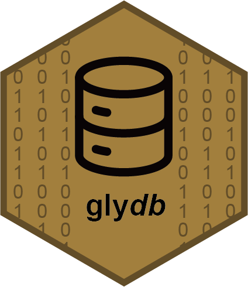

<!-- README.md is generated from README.Rmd. Please edit that file -->

```{r, include = FALSE}
knitr::opts_chunk$set(
  collapse = TRUE,
  comment = "#>",
  fig.path = "man/figures/README-",
  out.width = "100%"
)
```

# glydb <a href="https://glycoverse.github.io/glydb/"></a>

<!-- badges: start -->
[](https://lifecycle.r-lib.org/articles/stages.html#experimental)
[](https://CRAN.R-project.org/package=glydb)
[](https://github.com/glycoverse/glydb/actions/workflows/R-CMD-check.yaml)
[](https://app.codecov.io/gh/glycoverse/glydb)
<!-- badges: end -->

The goal of glydb is to provide a comprehensive database of glycan structures, including common glycan structures and their modifications.
The database is updated periodically and is used by the glycoverse ecosystem.
Only fully defined glycan structures are included.

## Installation

You can install the latest release of glydb from [GitHub](https://github.com/) with:

``` r
# install.packages("remotes")
remotes::install_github("glycoverse/glydb@*release")
```

Or install the development version:

``` r
remotes::install_github("glycoverse/glydb")
```

## Example

In glydb, we have two datasets.

The first one is `fully_determined_glycans`, which contains a curated list of fully determined glycan structures from GlyTouCan.

```{r}
library(glydb)
library(glyrepr)

fully_determined_glycans
```

The second one is `topology_glycans`, derived from `fully_determined_glycans`, removing all linkage information.

```{r}
topology_glycans
```